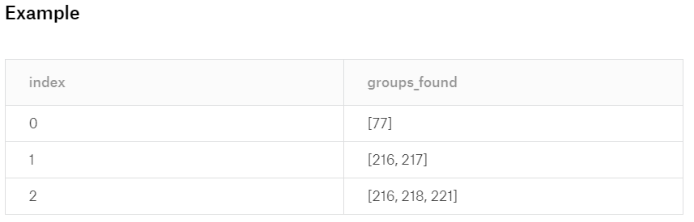
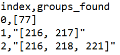

# [Undergraduate] I'm the Best Coder! Challenge 2019 - Round 1

[zhuhanming/shopee-best-coder-2019](https://github.com/zhuhanming/shopee-best-coder-2019/tree/master/round-1)

[[Undergraduate] I'm the Best Coder! Challenge 2019](https://www.kaggle.com/c/undrg-rd1-listings/overview)

# Description

At Shopee, we strive to ensure fairness to both buyers and sellers, and improve user experience by identifying and discouraging negative behaviour. Listing quality is a major area where poor behaviours often occur.

Every transaction on Shopee starts from a product listing. In order to get more sales, sellers may commit certain behaviour to increase their listings’ exposure and gain an unfair advantage over other shops. An example of such behaviour is keyword spam, whereby sellers input irrelevant keywords in the listing title that do not accurately describe the products they are selling. For instance, the product title claims that the listing is for “pants, shirt, shoes”, while the item that is actually being sold is just a pair of pants. Sellers do this in the hope that when buyers search for “shirt” or “shoes”, their listings would also appear in the search result.

This behaviour of spamming irrelevant keywords in the title may confuse search engine and could affect the accuracy of search results, and therefore result in a poor user experience. Therefore, it is important to identify, punish and deter such behaviour from existing on Shopee.

However, at the same time, we also need to consider the case that sellers input multiple product keywords in the listing title but those keywords are relevant to the products. An example is that the underlying product is a pair of shoes, and seller describes it in the listing title as "shoes, sneakers". In this case, the seller is trying to increase their search exposure, but does not use a misleading product title, and therefore should not be penalized.

While it is important to deter negative behaviour, it is also very important to avoid wrongly discouraging positive behaviour.

## **Task:**

Using the keyword directory, identify the product groups that are present in the product title.

## **Example:**

- Keyword list:Group: `0`, Keywords: `jacket`Group: `1`, Keywords: `windbreaker, raincoat`
- Product title:Index: `0`, Name: `red jacket windbreaker`

Since product title contains keywords from both group `0` and `1`.--> groups found: `[0,1]`

## **Input**

1.`Extra Material 2 - keyword list_with substring.csv`: List of product keywords, separated into product groups. Each row is a product group.

- The same keyword may appear in multiple groups (eg. `notebook`)
- Some of the keywords are substrings of other keywords. In this case, the longer word should take priority over the substring.

2.`Keyword_spam_question.csv`: File containing product name that you need to extract the product keyword groups.

## **Further Details**

You will be given a directory of product keywords, organized into keyword groups. The .csv file provided will have 2 columns:

`Group`: arbitrary index of the product keyword grouping

`Keywords`: product keyword.

- Keywords on the same row denote words that can refer to the same product, and therefore should be considered the same product type (eg. `raincoat` and `windbreaker` can refer to the same product)
- Keywords on different rows denote words that refer to different product types (eg. `shirt` and `raincoat` refer to different product types)
- One keyword may appear in multiple groups (eg. `notebook` could refer to a computing product or a stationary)
- **Note**: you do not need to look into the correctness of the grouping, and should use it as-is.

Using the keyword directory, you need to identify the product groups that are present in the product title. If 2 product groups are both equally presentable in the result, choose the group with the smaller index.

- Eg 1: `White netbook, ultrabook and gaming mousepad` should contain product groups `[77, 85]`, because keyword `netbook` is in group `77`; keyword `ultrabook` is also in group `77`; keyword `gaming mousepad` is in group `85`.
- Eg 2: `Beautiful red notebook shirt jeans` should contain product groups `[6, 29, 77]`, because keyword `notebook` is in groups `77` and `204`; keyword `shirt` is in group `29`; keyword `jeans` is in group `6`. Since using group `77` or group `204` will both result in 3 product groups, we will choose group `77` due to the smaller index.
- Eg 3: `Printer toner wallpaper ink` should contain product groups `[81, 182]`, because keyword `Printer toner` is in group `81`; keyword `wallpaper` is in group `182`. Even though keyword `Printer` is in another group (`79`), it is a substring of `Printer toner`. Therefore 'Printer toner' takes priority over 'Printer'.

## **Submit Format**

A `csv` file (`utf-8` encoding) containing 2 columns:

- `index` : index of the item in the `Keyword_spam_question.csv` file
- `groups_found` : `list` of groups that are found in the corresponding item title, sorted ascending. Group names should be according to `Extra Material 2 - keyword list_with substring.csv` file. If 2 product groups are both equally presentable in the result, choose the group with the smaller index.

### **Example:**

[Untitled](https://www.notion.so/7035e2ff5d9e40fa90b448d062a63d1d)

**Your submission should have 800000 rows, each with 2 columns.**

### **Tips:**

1) You are advised to run your tests on a sample of the dataset first.2) If you are unable to solve the entire problem within the time limit, create the output csv with the required number of columns and rows based on a subset of the problem first.

### **Teams which do not make a successful submission for both rounds of the competition will not be considered for the overall ranking.**

# Evaluation

**Evaluation criteria**

Your submission will be evaluated based on Categorization correctness. The score is the number of correct results that your submitted file contains.

# Data Description

You will be given a directory of product keywords, organized into keyword groups. The .csv file provided will have 2 columns:

`Group`: arbitrary index of the product keyword grouping

`Keywords`: product keyword.

- Keywords on the same row denote words that can refer to the same product, and therefore should be considered the same product type (eg. `raincoat` and `windbreaker` can refer to the same product)
- Keywords on different rows denote words that refer to different product types (eg. `shirt` and `raincoat` refer to different product types)
- One keyword may appear in multiple groups (eg. `notebook` could refer to a computing product or a stationary)
- **Note**: you do not need to look into the correctness of the grouping, and should use it as-is.

Using the keyword directory, you need to identify the product groups that are present in the product title. If 2 product groups are both equally presentable in the result, choose the group with the smaller index.

- Eg 1: `White netbook, ultrabook and gaming mousepad` should contain product groups `[77, 85]`, because keyword `netbook` is in group `77`; keyword `ultrabook` is also in group `77`; keyword `gaming mousepad` is in group `85`.
- Eg 2: `Beautiful red notebook shirt jeans` should contain product groups `[6, 29, 77]`, because keyword `notebook` is in groups `77` and `204`; keyword `shirt` is in group `29`; keyword `jeans` is in group `6`. Since using group `77` or group `204` will both result in 3 product groups, we will choose group `77` due to the smaller index.
- Eg 3: `Printer toner wallpaper ink` should contain product groups `[81, 182]`, because keyword `Printer toner` is in group `81`; keyword `wallpaper` is in group `182`. Even though keyword `Printer` is in another group (`79`), it is a substring of `Printer toner`. Therefore 'Printer toner' takes priority over 'Printer'.

## **Input**

1. `Extra Material 2 - keyword list_with substring.csv`: List of product keywords, separated into product groups. Each row is a product group.
    - The same keyword may appear in multiple groups (eg. `notebook`)
    - Some of the keywords are substrings of other keywords. In this case, the longer word should take priority over the substring.
2. `Keyword_spam_question.csv`: File containing product name that you need to extract the product keyword groups.

## **Submit Format**

A `csv` file (`utf-8` encoding) containing 2 columns:

- `index` : index of the item in the `Keyword_spam_question.csv` file
- `groups_found` : `list` of groups that are found in the corresponding item title, sorted ascending. Group names should be according to `Extra Material 2 - keyword list_with substring.csv` file. If 2 product groups are both equally presentable in the result, choose the group with the smaller index.

**When csv file is opened in Notepad**

**Your submission should have 800000 rows, each with 2 columns.**

### **Teams which do not make a successful submission for both rounds of the competition will not be considered for the overall ranking.**

**Backup Links for Data**

Google Drive - [https://drive.google.com/file/d/1J3gAvFs3z_ZbIPhMN2-MYlHoeJC3TydU/view?usp=sharing](https://drive.google.com/file/d/1J3gAvFs3z_ZbIPhMN2-MYlHoeJC3TydU/view?usp=sharing)

Dropbox - [https://www.dropbox.com/s/ip5vfcv3qc75tm6/Undergraduate%20Round%201.zip?dl=0](https://www.dropbox.com/s/ip5vfcv3qc75tm6/Undergraduate%20Round%201.zip?dl=0)