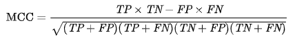
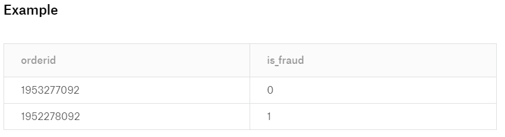
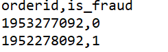

# [Undergraduate] I'm the Best Coder! Challenge 2019 - Round 2

[zhuhanming/shopee-best-coder-2019](https://github.com/zhuhanming/shopee-best-coder-2019/tree/master/round-2)

[[Undergrad] I'm the Best Coder! Challenge 2019](https://www.kaggle.com/c/ungrd-rd2-auo/)

# **Fraud Detection**

Fraudsters create fake transactions to boost sales/shop ratings. Fake transactions are defined as transactions where the buyer and seller are the same individual (in reality). To help Shopee tackle this issue, you are expected to detect these fake transactions from normal transactions. Sample data for transactions and users' details will be provided.

## **Task**

Find fake orders where the buyer and the seller are directly or indirectly linked, by any of the following links: Device, Credit Card, Bank Account.

- Direct link: the buyer and the seller share the same details.
- Indirect link: the buyer and the seller are not directly linked, but users who share the same details as them share details with one another:e.g. buyer - user A - user B - user C - … - user Z - seller

## **Basic Concepts**

Each userid represents a distinct user on Shopee.Each orderid represents a distinct transaction on Shopee.Device, Credit Card, Bank Account data is encrypted to preserve data privacy. Each distinct value represents a unique entity.

## **Examples**

### Example 1

orderid: 1955598428, buyer userid: 35545436, seller userid: 70763052.

The buyer has this device: "/3TLpeou8xXsNxpACFFKr34Kqqwxiu5Hi1keJ6plk5E=".The seller also has this device: "/3TLpeou8xXsNxpACFFKr34Kqqwxiu5Hi1keJ6plk5E=".Therefore, we consider that the buyer and the seller are directly linked by device.

This order is a fraud order by definition.

### Example 2

orderid: 1953543830, buyer userid: 223406364, seller userid: 193350172.

1. User 223406364 is directly linked to user 227839480 by sharing the same device "7q1zwUrfP8+09Z+EPh+YyNYTwxhHW7wfGuIFWhRE490=".
2. User 227839480 is directly linked to user 193350172 by sharing the same device "IkGjfHwwIGYxZ4WkM30COPKkmALyJfSSODpNTTPuMyS=".

Therefore, buyer (userid: 223406364) is indirectly linked to seller (userid: 193350172).This order is a fraud order by definition.

## **Submit Format**

Two columns required:

- orderid.
- is_fraud: assign value 1 if the order is fraud, otherwise 0.

### **Example**

[Untitled](https://www.notion.so/bf5b5712628444bf9a20e86f4bfc393c)

**Your submission should have 620947 rows, each with 2 columns.**

### **Tips:**

1) You are advised to run your tests on a sample of the dataset first.2) If you are unable to solve the entire problem within the time limit, create the output csv with the required number of columns and rows based on a subset of the problem first.

### **Teams which do not make a successful submission for both rounds of the competition will not be considered for the overall ranking.**

# Evaluation

Matthews correlation coefficient is used to verify the answer.

It takes into account true and false positives and negatives and is generally regarded as a balanced measure which can be used even if the classes are of very different sizes.[2] The MCC is in essence a correlation coefficient between the observed and predicted binary classifications; it returns a value between −1 and +1. A coefficient of +1 represents a perfect prediction, 0 no better than random prediction and −1 indicates total disagreement between prediction and observation.

The MCC can be calculated directly from the confusion matrix using the formula:

In this equation, TP is the number of true positives, TN the number of true negatives, FP the number of false positives and FN the number of false negatives. If any of the four sums in the denominator is zero, the denominator can be arbitrarily set to one; this results in a Matthews correlation coefficient of zero, which can be shown to be the correct limiting value.

## **Input**

orders.csv: It contains orders information. Columns: [orderid, buyer_userid, seller_userid].

devices.csv: It contains devices used by the users. Each value represents a unique device. If two users use the same device, they are linked by device. Columns: [userid, device].

credit_cards.csv: It contains credit cards used by the users. If two users use the same credit card, they are linked by credit card. Columns: [userid, credit_card].

bank_accounts.csv: It contains bank accounts used by the users. If two users use the same bank account, they are linked by bank account. Columns: [userid, bank_account].

## **Output**

Check each order and determine whether it is a fraud order.

**When csv file is opened in Notepad**

**Your submission should have 620947 rows, each with 2 columns.**

### **Teams which do not make a successful submission for both rounds of the competition will not be considered for the overall ranking.**

**Backup Links for Data**

Google Drive -

[https://drive.google.com/file/d/1kgZPKVm44ovpGPd8sGVZVCDplFqOTDgx/view?usp=sharing](https://drive.google.com/file/d/1kgZPKVm44ovpGPd8sGVZVCDplFqOTDgx/view?usp=sharing)

Dropbox -

[https://www.dropbox.com/s/cqpmmme93sq32se/Undergraudate Round 2.zip?dl=0](https://www.dropbox.com/s/cqpmmme93sq32se/Undergraudate%20Round%202.zip?dl=0)